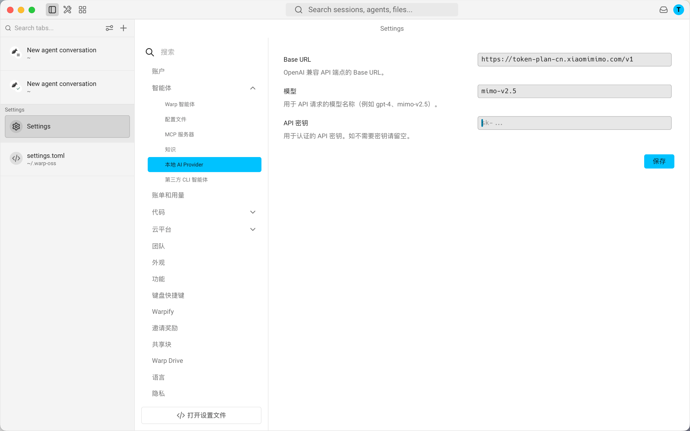
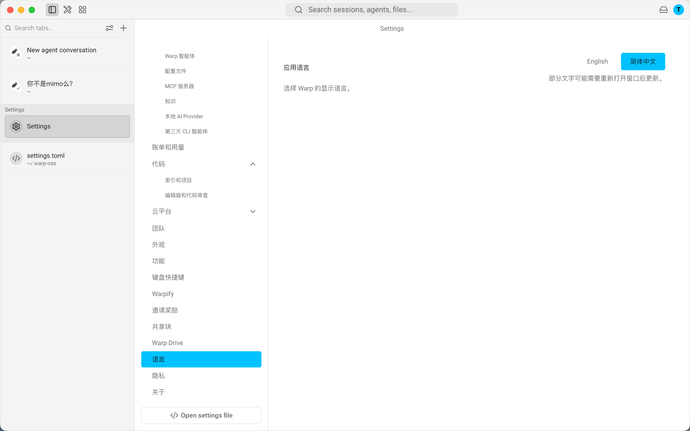

# WarpOss: Multilingual Local AI

[简体中文](README.zh-CN.md) | English

WarpOss is a community fork of the [Warp open-source project](https://github.com/warpdotdev/warp). The upstream project is a terminal and Agentic Development Environment for developers. This fork keeps the upstream foundation and focuses on local AI provider configuration and Simplified Chinese localization.

> [!IMPORTANT]
> This project is not an official Warp release and is not affiliated with the Warp team. Use, build, and redistribute it at your own risk, and follow the upstream license requirements.

## Highlights

- Local and third-party OpenAI-compatible AI provider support.
- Simplified Chinese interface with language switching.
- Existing Warp terminal, agent, third-party CLI agent, settings, and developer workflows preserved where possible.

## Local AI Provider

WarpOss adds a `Local AI Provider` settings page for OpenAI-compatible endpoints:

- `Base URL`: for example, `https://api.example.com/v1`
- `Model`: for example, `gpt-4`, `mimo-v2.5`, or any model name supported by your provider
- `API Key`: the key used by your personal or third-party AI service

After saving the configuration, Warp agent requests can use your configured local or third-party provider instead of relying only on the official Warp AI subscription entry point.



The setting is stored in Warp's settings file with a structure similar to:

```toml
[agents.local_provider]
enabled = true
base_url = "https://api.example.com/v1"
model = "your-model"
api_key = "your-api-key"
```

## Multilingual UI

WarpOss adds a language settings page. The current options are:

- English
- Simplified Chinese

When Simplified Chinese is selected, settings navigation, many settings pages, menu items, and major AI-related pages are displayed in Chinese. Some dynamic text or upstream strings may still appear in English and can be improved over time.



## Usage

### Configure a Third-Party AI Provider

1. Open `Settings`.
2. Go to `Agent` -> `Local AI Provider`.
3. Fill in `Base URL`, `Model`, and `API Key`.
4. Click `Save`.
5. Return to the Agent page and test the agent flow.

### Change Language

1. Open `Settings`.
2. Go to `Language`.
3. Select `English` or `Simplified Chinese`.
4. Some UI text may require reopening the window to refresh.

## Build

WarpOss keeps the upstream Rust/Cargo build system. Before building for the first time, read:

- [WARP.md](WARP.md)
- [CONTRIBUTING.md](CONTRIBUTING.md)
- [Upstream Warp repository](https://github.com/warpdotdev/warp)

Common commands:

```bash
./script/bootstrap
./script/run
./script/presubmit
```

macOS builds require a full Xcode installation, the Metal toolchain, and a working Rust environment. Windows portable package builds can use the packaging workflows included in this repository.

## Relationship to Upstream

This project is based on:

<https://github.com/warpdotdev/warp>

The goal is not to replace the official Warp release. WarpOss explores:

- More open AI provider configuration
- A localized experience for Chinese users
- A community version that can be built and distributed independently

Use the official Warp release if you need official support, official cloud service compatibility, or commercial service guarantees.

## License

WarpOss inherits the upstream Warp license structure:

- `warpui_core` and `warpui` crates are licensed under the [MIT license](LICENSE-MIT).
- The rest of the repository is licensed under [AGPL v3](LICENSE-AGPL).

Follow the corresponding licenses when redistributing, modifying, or publishing derived versions.

## Disclaimer

This project is intended for learning, research, and personal use. It does not provide third-party API keys, proxy model services, or guarantee compatibility with official Warp cloud services.
